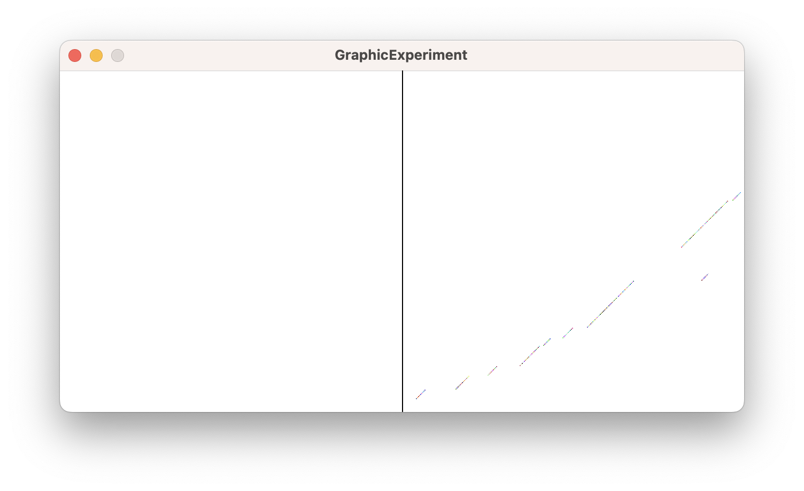

This is scala project with async calls.

## Graphic experiment

I don't recall exactly why I've written this code, but it is an interesting way of writing Scala 3 code with
[Processing]. Unfortunately, I think they don't want to put too much effort on distributing [Processing] as a Java
library. It looks like they want users to use their sketchbook interface instead. As a consequence, `core.jar` is not
available into [maven central repository] and needs to be built with [ant]ique tool.

Here is a sample result of this code:



### Processing dependency

To build `lib/core.jar`: I've installed [ant] with [homebrew] and then:

```shell
cd ..
git clone git@github.com:processing/processing4.git
cd processing4/build
ant build
cp ../core/library/core.jar ../../code-samples/scala/lib/
```

[ant]: https://ant.apache.org "Web site of the Apache Ant project"
[maven central repository]: https://central.sonatype.com
[homebrew]: https://brew.sh "Web site of Homebrew: The Missing Package Manager for macOS (or Linux)"
[Processing]: https://processing.org "Web site of Processing: a flexible software sketchbook and a language for learning how to code."
